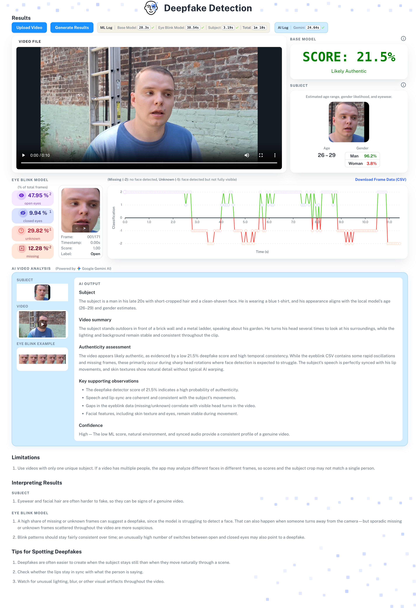
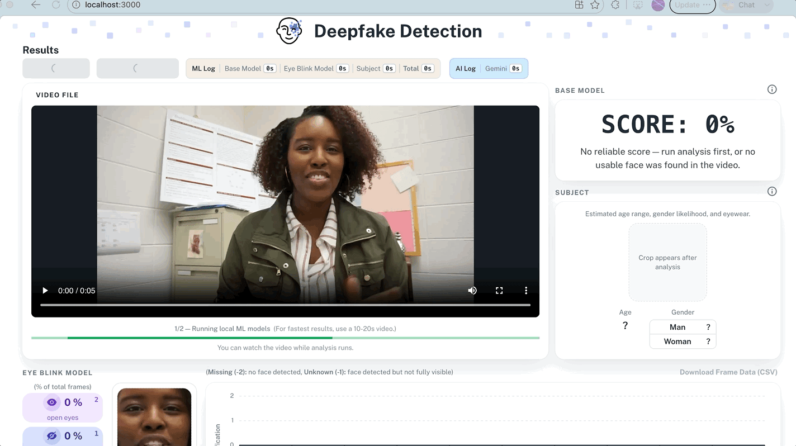

# Introduction

Welcome to Deepfake Detection. This application uses several ML models to process a video: a base model scores the likelihood of a deepfake (0% for genuine, 100% for deepfake), while a second model tracks eyeblinks throughout the video. When the base model's continuous score falls in the uncertain range (35%-65%), it's important to look at other signals, such as eyeblinks, to arrive at a verdict. Additional models also detect the subject's age, gender, and eyewear (such as sunglasses) to provide further context. Once the ML models finish running, cloud AI is given the ML outputs, video, and several image frames to produce a holistic overview of the likelihood of a deepfake. Due to the difficulty of identifying advanced deepfakes, such as those now easily generated by current genAI models, this application doesn't aim to give a single confident verdict, but rather a range of useful feedback.

# Background

Deepfakes have been around for a while. Back in the day, it was prone to obvious blurring and visual artifacts, making them obvious to spot. However in 2020, a [Tom Cruise deepfake](https://www.youtube.com/watch?v=p7-B8S734T4) was going viral for its impressive real life quality. However this was only made possible from a combination of factors: using an AI model trained from pictures of Tom Cruise, careful VFX editing, and overlaying the deepfake on a person with similar qualities (a Tom Cruise lookalike). Although impressive, it proved impractical for most people to replicate. However, in 2022 the genAI boom started with the release of ChatGPT. Chatbot AI's soon expanded with the feature to create a video from a prompt or an image. With little work, the average person can make a deepfake of anyone. Although the models have guardrails to prevent generative works of famous people, these can be bypassed by curating the prompt.  

# How it Works  

The backend runs 1 base model and 3 user trust models, then sends their combined outputs to a cloud AI for a final written summary.

4 Machine Learning Models:
1. *DFD* - base model that takes video as input and returns a continuous score on the likelihood of a deepfake. <50% means not a deepfake and >50% means a deepfake.
2. *blink* - classifies individual video frames as open eyes or closed eyes. When only one eye is visible, such as when only part of the face is shown, the model classifies it as unknown. If a face is missing entirely, the model classifies it as missing.
3. *age/gender* - estimates the subject's age and gender from face crops captured during the blink pass.
4. *shades* - detects if the subject has eyewear such as sunglasses.

Once these 4 models finish, their outputs (along with the video and some sampled frames) are sent to Gemini, which writes a holistic, natural-language summary of the findings.  

# Application Demo

The following is a quick demonstration of the application in action. First, the user clicks 'Upload Video' and selects a local video file. Once the video uploads successfully, clicking 'Generate Results' runs analysis: the local ML models run first, followed by the cloud AI step, while a progress bar keeps the user informed since the process can take a few moments.   

  

To successfully run the application, follow all instructions located in backend - README.md.  

# Languages  

Most of the project was written in Python and React (Javascript). Jupyter Notebooks are used throughout the testing folder for model training and evaluation, and a few Shell scripts help set up and run the backend.  

# Project Directories  

1. **testing** - All_Models_Evaluation.html goes into detail on the problem of deepfake detection, methods used to evaluate models, and evaluation results. This folder also holds the notebooks and scripts used to train and evaluate the blink and eyewear models.
2. **backend** - code for running the models (including the Gemini-based cloud AI summary) to obtain outputs, and a server that sends the output to the application frontend.
3. **src, public** - frontend design elements and logic of component interactions.

# Frontend

Our frontend code is all inside the src folder, with routes.js defining the app's routes. It is sectioned into:

1. **components** - the ui components that the main pages and layouts utilize
2. **layouts** - the layouts of each page. This simply gives a fixed way in which the page is displayed
3. **pages** - the pages of the application. Right now there's one main dashboard page that handles the core experience, plus a 404 page for unmatched routes
4. **theme** - the theme of the application. This includes basic styling and coloring schemes that is maintained throughout all components or pages
5. **utils** - shared functions (and a couple of small config/data files) utilized across the application  

