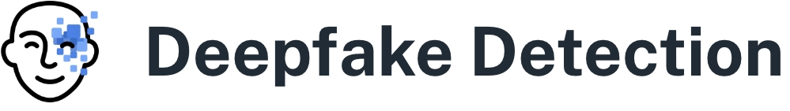

# Introduction

Welcome to Deepfake Detection. This application uses multiple ML models to help users identify deepfake videos. Thanks to the proliferation of ai-generated deepfakes, it's now more important than ever for people to have access to available technologies that can help them discern whether a video is genuine or not. By using this application, users can interpret ML model outputs to make their own judgments on the legitimacy of a video.  

# Background

Deepfakes have been around for a while. Back in the day, it was prone to obvious blurring and visual artifacts, making them obvious to spot. However in 2020, Tom Cruise deepfake was going viral for its very impressive quality. However this was only made possible from a combination of factors: using an AI model trained from pictures of Tom Cruise, careful VFX editing, and overlaying the deepfake on a person with similar qualities (a Tom Cruise lookalike). Although impressive, it proved impractical for most people to replicate. However, in 2022 the genAI boom started with the release of ChatGPT. Chatbot AI's soon expanded with the feature to create a video from a prompt or an image. With little work, the average person can make a deepfake of anyone. Although the models have guardrails to prevent generative works of famous people, these can be bypassed by curating the prompt.  

# How it Works  

The backend uses 1 base model and 2 user trust models.

3 Machine Learning Models:
1. *DFD* - base model that takes in videos as input and returns a continuous score on the likelihood of a deepfake. <50% means not a deepfake and >50% means a deepfake.
2. *blink* - classifies individual video frames as open eyes or closed eyes. When only one eye is visible, such as when only part of the face is shown, the model classifies it as unknown. If a face is missing entirely, the model classifies it as missing.
3. *shades* - detects if the subject has eyewear such as glasses or sunglasses.  

# Application Demo

The following is a brief demonstration of the application. First, the user clicks 'Upload Video' and selects a local video file. If the video was uploaded successfully, the user can then click 'Generate Results' to run analysis. First local ML models run then the Cloud AI runs.   

  

To successfully run the application, follow all instructions located in backend - README.md.  

# Languages  

Most of the project was written in Python and React. Some files were written in Javascript.  

  

# Project Directories  

1. **testing** - All_Models_Evaluation.html goes into detail on the problem of deepfake detection, methods used to evaluate models, and evaluation results.
2. **backend** - code for running the models to obtain outputs and setting up a server that sends the output to the application frontend.
3. **src, public** - frontend design elements and logic of component interactions.

# Frontend

Our frontend code is all inside src folder. It is sectioned into:

1. **components** - the ui components that our main pages and layouts utilize
2. **layouts** - the layouts of each page. This simply gives us a fixed way in which the page is displayed
3. **pages** - the pages of the application. This is for each route on the application (e.g: /home, /home/app)
4. **theme** - the theme of the application. This includes basic styling and coloring schemes that is maintained throughout all components or pages
5. **utils** - the utils folder simply has functions that we utilize throughout the application  

